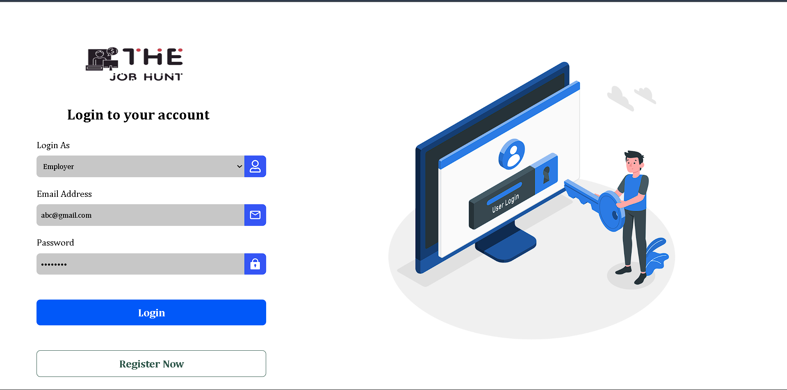

# Job-Portal

A full-stack MERN (MongoDB, Express, React, Node.js) job seeking web application.

## Features

- User registration and login (Job Seeker & Employer roles)
- Employers can post, edit, and delete jobs
- Job Seekers can browse and apply to jobs
- Resume upload and application management
- Responsive UI with React
- RESTful API backend with Express and MongoDB
- Cloudinary integration for resume uploads


## UI Overview

### Login



## Project Structure

```
.
├── backend/
│   ├── app.js
│   ├── server.js
│   ├── controllers/
│   ├── models/
│   ├── routes/
│   ├── middlewares/
│   ├── utils/
│   ├── database/
│   └── config/
└── frontend/
    ├── src/
    │   ├── components/
    │   ├── App.jsx
    │   ├── main.jsx
    │   └── App.css
    ├── public/
    ├── index.html
    └── package.json
```

## Getting Started

### Prerequisites

- Node.js (v18+ recommended)
- MongoDB (local or Atlas)
- Cloudinary account (for resume uploads)

### Backend Setup

1. Navigate to the backend folder:

   ```sh
   cd backend
   ```

2. Install dependencies:

   ```sh
   npm install
   ```

3. Configure environment variables in `config/config.env`:

   ```
   PORT=4000
   MONGO_URI=your_mongodb_uri
   CLOUDINARY_CLIENT_NAME=your_cloudinary_name
   CLOUDINARY_CLIENT_API=your_cloudinary_api_key
   CLOUDINARY_CLIENT_SECRET=your_cloudinary_api_secret
   FRONTEND_URL=http://localhost:5173
   JWT_SECRET_KEY=your_jwt_secret
   JWT_EXPIRE=7d
   COOKIE_EXPIRE=5
   ```

4. Start the backend server:

   ```sh
   npm run dev
   ```

### Frontend Setup

1. Navigate to the frontend folder:

   ```sh
   cd frontend
   ```

2. Install dependencies:

   ```sh
   npm install
   ```

3. Start the frontend development server:

   ```sh
   npm run dev
   ```

4. Open [http://localhost:5173](http://localhost:5173) in your browser.

## Usage

- Register as a Job Seeker or Employer.
- Employers can post and manage jobs.
- Job Seekers can browse jobs and apply with a resume.
- Both roles can manage their applications and jobs.

## Tech Stack

- **Frontend:** React, Vite, React Router, Axios, React Hot Toast, React Icons
- **Backend:** Node.js, Express, MongoDB, Mongoose, Cloudinary, JWT, bcrypt
- **Other:** Cloudinary for file uploads, dotenv for environment variables

---

**Developed by Pratik Dhangar 
